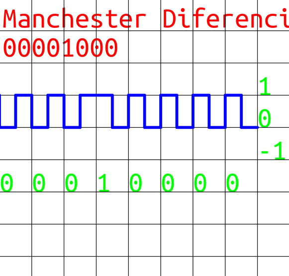

# Generate binary plot of different binary codes

Giving an input of a 1 byte number the program plots the value into different images

We are currently supporting 6 binary codes

1. NRZI (No Return to Zero Inverted)
2. NRZL (No Return to Zero Level)
3. Bipolar AMI (Alternate Mark Inverted)
4. Pseudoternary
5. Manchester Encoding
6. Differential Manchester Encoding

## Building

1. Install go lang binaries from [here](https://go.dev)

- On Windows: Open PowerShell and execute the build.ps1 script

`.\build.ps1`

- On Linux: Execute the build.sh script

`./build.sh`

On both a folder named build/ will be created with the app binary

## Example

Execute the app from the cli and pass it the one byte unsigned number to plot as first argument.

`./app 8`

Output:

